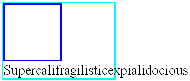
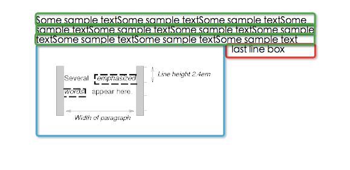

#可视化格式模型（Visual formatting model）
---
[英文原版点击这里](http://dev.w3.org/csswg/css2/visuren.html)

##1. 可视化格式模型介绍（Introduction to the visual formatting model）

本章和[下一章](可视化格式模型细节.md)描述可视化格式模型：浏览器怎样将文档树处理为可视化网页。

CSS 视觉格式化模型(visual formatting model)是用来处理文档并将它显示在视觉媒体上的机制。这是 CSS 的一个基础概念。 视觉格式化模型根据 CSS 盒模型为文档的每个元素生成 0，1 或多个盒。每个盒的布局由如下内容组成：

- 盒尺寸：明确指定，受限或没有指定
- 盒类型：行内(inline), 行内级别(inline-level), 原子行内级别(atomic inline-level), 块(block)盒；
- 定位方案(positioning scheme): 常规流，浮动或绝对定位；
- 树中的其它元素: 它的子代与同代；
- 视口(viewport) 尺寸与位置；
- 内含图片的固定尺寸；
- 其它信息。

一个盒相对于它的包含块(containing block) 的边界来渲染。通常盒为它的后代元素建立包含块。注意盒并不受它的包含块的限制，当它的布局跑到包含块的外面时称为溢出(overflow)。

视觉可视化模型并没有提供所有方面的格式，比如没有提供字母间距算法，这些格式在不同的浏览器上可能存在不同的格式。

###1.1 视口（The viewport）

浏览器窗口。

###1.2 包含块（Containing blocks）

在CSS2.1中，许多盒子的定位和尺寸都是根据一个叫做包含块的矩形框的边缘计算的。一般来说，盒子是它后代盒子的包含块。 我们说一个盒子的包含块是指这个盒子所在的包含块。

每个盒子根据它的包含块定位，但盒子不限制在包含块中，它可能是溢出的。

##2. 控制包含框的生成（Controlling box generation）
这一节描述CSS2.1中盒子的类型。一个盒子的类型在某种程度上影响它在视觉可视化模型中的表现。使用display指定盒子类型。

使用display的某个确定值能为源文档中的元素生成一个包含后代盒子和内容的主盒，这个主盒也是参与到任何定位方案中的那个盒子。像list-item这种display会生成额外的盒子，以便容纳多余的内容。

###2.1 块级元素（Block-level elements）和块盒（block boxes）

块级元素-那些在源文档中被格式化为block的元素-会生成一个块级主盒。能使元素变为块级的属性包括：block,list-item,table。块级盒子参与BFC。

在CSS2.1中，块级盒子也是块容器，除非这个盒子是table或者是替换元素的主盒。块容器要么包含块级盒子，要么创建IFC用来包含行内级盒子。一个元素的主盒如果是块容器，那么这个元素是块容器元素。display为block,list-item,inline-block时可以使一个非替换元素生成一个块容器。不是所有的块容器都是块级盒子：非替换行内块和非替换table cell是块容器但不是块级盒子。如果一个盒子既是块级盒子又是块容器那这个盒子就叫做块盒子。

####2.1.1 匿名块盒子（Anonymous block boxes）

有时需要添加补充性盒，这些盒称为匿名盒(anonymous boxes),  它们没有名字，不能被 CSS 选择符选中。

不能被 CSS 选择符选中意味着不能用样式表添加样式。这意味着所有继承的 CSS 属性值为 inherit ，所有非继承的 CSS 属性值为 initial 。

块容器盒要么只包含行内级盒，要么只包含块级盒。但通常文档会同时包含两者。在这种情况下，将创建匿名块盒来包含毗邻的行内级盒。

拿下面的 HTML 代码来说 ( `
` 与 `
` 使用默认属性 display:block )

	

		Some inline text 
		
followed by a paragraph
 
		followed by more inline text.
	

将创建两个匿名块盒，一个包含 `
` 前面的文本 (Some inline text)， 一个包含 `
` 后面的文本(followed by more inline text),  结构如下:

> 结果：
> 
> 1. Some inline text
> 2. followed by a paragraph
> 3. followed by more inline text.

和 `
` 元素不同, 开发者不能控制这两个匿名盒。对于可继承属性， 它们将取 `
` 的属性值, 比如 color。对于非继承属性，值为初始值 ，比如没有指定 background-color, 值为初始值即 transparent，于是 `
` 背景可见。而 `
` 可以指定 background-color 。类似的，这两个匿名盒文本是一样的颜色。

###2.2 行内级别元素和行内盒子（Inline-level elements and inline boxes）

行内元素是那些源文档中不产生块级内容的元素。内容分布在行中。display为inline,inline-table,inline-block时元素是行内级别的。行内级别元素生成行内级别盒子，参与IFC。

行内盒子不仅是行内级别的，而且他的内容参与他包含的IFC。display为inline的非替换元素生成行内盒子，不是行内级别盒子的行内盒子被叫做原子行内级别盒子，因为他被当做单独的不透明盒子参与到IFC中。

####2.2.1 匿名行内盒子（Anonymous inline boxes）

类似于块盒，CSS 引擎有时自动生成行内盒。这些盒也是匿名的，因为它们没有对应的选择器名字。它们继承所有可继承的属性，非继承的属性取 initial。 

匿名行内盒最常见的例子是块盒直接包含文本，文本将包含在匿名行内盒中。空白如果使用white-space 去掉，则不会生成匿名行内盒。

###2.3 Run-in盒子（Run-in boxes）

被移动到CSS3规范中。

###2.4 行盒（line box）

行盒（Line boxes）：行盒是由行内格式化上下文产生的盒，用于表示一行。在块盒里面，行盒从块盒的一边排版到块盒的另一边。当有浮动时，行盒从左浮动的最右边排版到右浮动的最左边。

###2.4 display属性（The 'display' property）

<table style="border-collapse: collapse">
<tbody>
<tr>
<td>
<b>值</b>
</td>
<td>
<b>含义</b>
</tr>
<tr>
<td>block</td>
<td>让元素生成一个块盒子</td>
</tr>
<tr>
<td>inline-block</td>
<td>让元素生成一个行内级别的块容器（元素内部被格式化成块盒子，元素本身被格式化成原子行内级别元素）</td>
</tr>
<tr>
<td>inline</td>
<td>让元素生成一个或多个行内盒子</td>
</tr>
<tr>
<td>list-item</td>
<td>让元素生成一个主块框和一个marker box（看上去就是用来容纳list前面的点的）</td>
</tr>
<tr>
<td>none</td>
<td>让元素不出现在格式结构中，这个行为不能通过设置后代的display重置</td>
</tr>
<tr>
<td>
table, inline-table, table-row-group, table-column, table-column-group, table-header-group, table-footer-group, table-row, table-cell, and table-caption
</td>
<td>
让元素的行为看上去像table元素
</td>
</tbody>
</table>

计算的值和提供的值是一致的，除非是定位元素、浮动元素和根元素。对于根元素，计算的值会按照 relationships between 'display', 'position', and 'float'. 这一节中描述的情况改变。

注意，display的初始值是inline，浏览器中的默认规则可能会重写这个值。

##3. 定位方案（Positioning schemes）

CSS2.1中有三种定位方案：

- 正常流

	正常流包括块级盒子的块格式化；行内级别盒子的行内格式化；块级盒子和行内级别盒子的相对定位。
 
- 浮动
 
	在浮动模型中，盒子首先按照正常流放置，然后从正常流中脱离并向左或右移动尽可能的远。

- 绝对定位

	元素从正常流中完全移除然后根据包含块分配一个位置。

当元素是浮动的或绝对定位的，我们说这个元素不在流中，或者这个元素是根元素。除了上述情况，元素都在流中。The flow of an element A is the set consisting of A and all in-flow elements whose nearest out-of-flow ancestor is A.

###3.1 position属性（Choosing a positioning scheme: 'position' property）

<table style="border-collapse: collapse">
<tbody>
<tr>
<td>
<b>值</b>
</td>
<td>
<b>含义</b>
</tr>
<tr>
<td>static</td>
<td>盒子根据正常流放置，'top', 'right', 'bottom', 'left'不可用</td>
</tr>
<tr>
<td>relative</td>
<td>
盒子的位置根据其在正常流中的定位计算，然后根据正常位置偏移。如果一个盒子B是相对定位的，它后面的盒子在定位时会根据B的正常位置计算。
</td>
</tr>
<tr>
<td>absolute</td>
<td>
盒子的位置由 'top', 'right', 'bottom', 'left'属性提供，这些属性根据盒子的包含块计算偏移。绝对定位元素被移除出正常流，也就是说它放置时后面的兄弟元素当它不存在。而且，绝对定位的盒子有margin，但是不和任何margin合并。
</td>
</tr>
<tr>
<td>fixed</td>
<td>
盒子的定位方法和absolute一样，但是是根据浏览器窗口而不是包含块计算偏移，并且滑动视口时不移动。
</td>
</tr>
</tbody>
</table>

用户代理可能把根元素的position视作static。

###3.2 盒偏移量：'top', 'right', 'bottom', 'left'（Box offsets: 'top', 'right', 'bottom', 'left'）

<table style="border-collapse: collapse">
<tbody>
<tr>
<td>
<b>值</b>
</td>
<td>
<b>含义</b>
</tr>
<tr>
<td>top</td>
<td>
盒子如果是绝对定位，top就是盒子上外边距边界到包含块上边界的偏移量。
盒子如果是相对定位，就根据盒子在正常定位时的位置偏移。
</td>
</tr>
<tr>
<td>right</td>
<td>
与top类似。
</td>
</tr>
<tr>
<td>bottom</td>
<td>
与top类似。
</td>
</tr>
<tr>
<td>left</td>
<td>
与top类似。
</td>
</tr>
</tbody>
</table>

以上属性有下面四种值类型：

- 长度

- 百分比

	相对包含块（几乎就是父元素）的宽度或高度的百分比。

- auto

	后面说。

##4. 正常流（Normal flow）

正常流中的盒子属于一个格式化上下文，这个上下文在CSS2.1中可能是table，block，inline。块级盒子参与块格式化上下文，行内级盒子参与行内格式化上下文，表格格式化上下文在[表格章节](http://dev.w3.org/csswg/css2/tables.html)描述。

###4.1 块级格式化上下文（BFC）

块格式化上下文block formatting context 是页面 CSS 视觉渲染的一部分。它是用于决定块盒子的布局及浮动相互影响范围的一个区域。

下列情况将创建一个块格式化上下文：

- 根元素或其它包含它的元素
- 浮动 (元素的 float 不为 none)
- 绝对定位元素 (元素的 position 为 absolute 或 fixed)
- 内联块 inline-blocks (元素的 display: inline-block)
- 表格单元格 (元素的 display: table-cell，HTML表格单元格默认属性)
- 表格标题 (元素的 display: table-caption, HTML表格标题默认属性)
-  overflow 的值不为 visible的元素
- 弹性盒 flex boxes (元素的 display: flex 或 inline-flex，设计CSS3规范)

块格式化上下文包括了创建该上下文的元素的所有子元素，但不包括创建了新的块格式化上下文的子元素。

块格式化上下文对定位 (参见 float) 与清除浮动 (参见 clear) 很重要。定位和清除浮动的样式规则只适用于同一块格式化上下文中的元素。浮动不会影响其它块格式化上下文中元素的布局，清除浮动只清除同一块格式化上下文中，在它前面的元素的浮动

###4.2 行内格式化上下文（Inline formatting contexts）

又长又无聊

###4.3 相对定位（Relative positioning）

如果left和right都是auto（默认值），使用值是0。

如果left是auto，根据right偏移。

反之根据left偏移。

如果两个值都不是auto，忽略一个，对于从左往右阅读的语言，使用left的偏移值。

在top和bottom中，当两个只都存在时，bottom被忽略。

##5. 浮动（Floats）

浮动是指一个盒在当前行中被变换到左边或者右边。浮动最有意思的特点是内容将沿着它的边缘放置（或者可以通过“clear”属性阻止它们这么做）。内容从一个左浮盒的右边往下或者从一个右浮盒的左边往下放置。下面是对浮动定位方式和内容流的介绍；“float”属性的描述给出了精确的控制浮动行为的规则。

一个浮动盒被变换到左边或者右边直到它的外边缘接触到包含盒的边缘或者他的外边缘接触到另外一个浮动元素。如果在一个line box中，浮动盒的外顶部和当前line box的顶部对齐。

如果没有足够的水平空间容纳浮动元素，它会往下直到有合适的空间放置或者不再有浮动元素存在。

因为浮动元素不在流中，非定位块盒会在浮动盒的前后垂直放置，就像浮动元素不存在一样。但是，紧邻浮动元素创建的当前和随后的line box必须被缩短以使得有空间容纳浮动元素的margin box（译注：这里指content box，boder box类似的这样的概念，就是浮动元素包含margin的那个区域）。

当存在一个垂直位置全部满足下面四个条件时，一个line box可以跟浮动元素紧挨：

1. 在line box顶部上或在line box顶部的下面。（at or below）。
1. 在line box底部上或在line box底部的上面。（at or above）。
1. 在浮动元素顶部margin边缘的下面。（below）。
1. 在浮动元素底部margin边缘的上面。（above）。

如果一个缩短line box对于它的内容来说太小，那么line box将被向下移动（它的宽度将被重新计算）直到内容合适或者不在存在浮动元素。任何在当前行内，在这个浮动盒之前的内容将被在浮动元素的另一边重新排布(与float在同一行)。换句话说，如果行内级盒被放置在一个左浮的盒子之前的行中并且除去浮动元素后剩下的line box空间正好合适的话，这个左浮元素会被放置在那行中，与line box的顶部对齐，然后该行中这个先前的行内级盒将相应的移动到浮动元素的右边（这个右边是左浮元素的另外一边），对于rtl和右浮元素亦是如此。

table, 块级可被重放置元素（有内置行高的元素），或者正常流中建立了一个新的块格式化上下文的元素（例如拥有除了“visible”的值外的值的“overflow”属性的元素）的border box必须不与在同一个格式化上下文中的任何浮动元素的margin box重叠。如果有这种必要， 实现必须通过把上述元素放置在任何浮动元素下面来清除它，但如果有足够的空间的话它可以毗邻这样的浮动元素被放置。它们甚至可能使得上述元素的border box比10.3.3章定义的更窄。CSS2没有定义一个客户端代理应该怎样紧邻浮动放置上述的元素或者上述的元素应该变窄多少。

例子。在下面的文档片段中，包含块太窄以至于无法包含和浮动元素相邻的内容，因此内容被移动到浮动元素的下面，它在line box中的对齐取决于text-align属性。

	p { width: 10em; border: solid aqua; }
	span { float: left; width: 5em; height: 5em; border: solid blue; }
	...
	

	   
	  Supercalifragilisticexpialidocious
	

多个浮动元素是紧邻的，而且这个模型也应用于相同行中的紧邻的浮动元素。

下面的规则通过class=“icon”将所有的img盒浮动到左边（并且设置margin为0）：

	img.icon { 
	  float: left;
	  margin-left: 0;
	}

思考下面的HTML源代码和样式表：

	<!DOCTYPE HTML PUBLIC "-//W3C//DTD HTML 4.01//EN">
	<HTML>
	  <HEAD>
	    <TITLE>Float example</TITLE>
	    
	  </HEAD>
	  <BODY>
	    

	       Some sample text that has no other...
	  </BODY>
	</HTML>

IMG盒被浮动到左边。随后的内容被格式化到浮动元素的右边，从与浮动元素相同的行开始。由于浮动元素的存在，浮动右边的line box太短，但在浮动的后面（译注：这里指这个浮动不再占据空间的那个地方）回到它们的“normal（正常）”宽度（P元素建立的包含块的宽度）。这个文档可能被像下面那样格式：

如果文档是下面这样，格式化将会完全一致：

	<BODY>
	  
Some sample text 
	  
	           that has no other...
	</BODY>

因为浮动元素左边的内容沿着浮动元素显示并且从它的右边重新向下排布。

浮动盒子的margin不会和相邻的盒子的margin折叠。也就是说，在前面的这个例子中，浮动的img盒子跟p盒子之间的margin不会折叠。

浮动元素的内容被堆积就像浮动元素生成了新的堆叠上下文（stacking contexts），除了那些定位和确实创建了堆叠上下文参与了浮动元素的父元素的堆叠上下文的元素。正常流中浮动元素能够覆盖其他盒（例如，当一个拥有负margin的正常流的盒子与一个浮动元素紧邻时）。当这种情况发生时，浮动元素被渲染在非定位的流内块的前面，但在流内的行内元素后面。

这里有另外一个图例, 展现了正常流中一个浮动元素覆盖元素border的时候的情况。

一个浮动的图片遮盖了和它重叠的块盒的边框。

下面的例子表明“clear”属性的用法，用来防止内容紧随一个浮动元素放置。

假定一个像这样的规则：

	p{clear: left}

格式化结果看起来像这样：

两个段落都被设置了“clear：left”属性，这导致了第二个段落被“往下推”到浮动元素的下方——“空隙”被添加到它的上margin处以达到这个效果（见“clear”属性）。

###5.1 定位浮动元素：“float”属性(Positioning the float: the 'float' property)

这里有一些控制浮动元素行为的精确规则：

1. 一个左浮盒子的左外边缘不会在它的包含块的左边缘的左边。右浮元素也保持相似的规则。
1. 如果当前的盒子是左浮的，且源文档中存在较早的生成的左浮的盒子的元素，那么对于每一个这样的早期盒子，当前盒子的左外边必须在这个早先的盒子的右外边缘的右边，或者它的顶部必须低于早先的盒子的底部。右浮盒子也保持相似的规则。
1. 一个左浮盒子的右外边缘不能在任何与它相邻的右浮元素的左外边缘的右边。右浮元素也保持相似的规则。
1. 一个浮动盒子的外顶部不能比它的包含盒更高。当浮动在两个折叠的margin间发生的时候，浮动元素的定位就像它拥有另外一个空的父级匿名块。这样一种父级定位在margin collapsing这个章节定义。
1. 一个浮动盒的外顶部不能高于任何块或者由源文档中更早的元素生成的浮动盒的外顶部。
1. 一个元素的浮动盒的外顶部不能高于任何由源文档中更早的元素生成的line-box包含一个盒子的顶部。
1. 左边有另外一个左浮盒子的左浮盒子的右外边缘不能在它的包含块的右边缘的右边。（不严格的说：一个左浮元素不能超出右边缘，除非它已经尽可能的的放在左边。）右浮元素也保持相似的规则。
1. 浮动盒必须尽可能的往高处放。
1. 左浮盒子必须尽可能的放在左边，右浮盒子必须尽可能的放在右边。一个更高的位置优先分配给距离左/右更远的元素。

但在CSS2.1中，如果，在一个块格式化上下文中，存在一个流内拥有垂直方向margin为负值的元素，那么浮动元素的位置在它原本的那个位置的之上，就是所有这些负margin的元素设置成0的时候的位置，浮动元素的位置是未定义的。

在这些规则中其他元素的说明只适用于在相同块格式化上下文中浮动的元素。

这个HTML片段的结果是b浮动到右边。

	
ab

如果p元素足够宽，a和b将并排，看起来就像这样：

###5.2 紧邻浮动元素的控制流：“clear”属性(Controlling flow next to floats: the 'clear' property)

这个属性指明了一个元素的盒子的哪一边不和更早的浮动盒子相邻。“clear”属性不考虑在元素自身内部或者在其它块格式化上下文中的浮动元素。

当将下面的值应用于非浮动块级盒的时候它们的含义如下：

left 要求盒子的上边框边缘在任何源文档中比这个盒子早的元素引起的左浮盒的外底部边缘的下面。

right 要求盒子的上边框边缘在任何源文档中比这个盒子早的元素引起的右浮盒的外底部边缘的下面。

both 要求盒子的上边框边缘在任何原文档中比这个盒子早的元素引起的左浮或者右浮盒子的外底部边缘下面。

none 对盒子与浮动元素相关的位置没有做约束。

除“none”外的值潜在的引入了间隙。间隙阻止margin折叠并且承担了一个元素的上margin上面的空间的角色。它被用来垂直推动元素超过浮动元素。

一个“clear”元素被设置的间隙可以通过先确定元素上边框边缘的假定位置，即元素的“clear”属性被设置为“none”时的上外边框边缘来计算。

如果这个元素的上边框边缘的这个假定位置没有超过相关的浮动元素，那么间隙被引入，而且margin折叠依据8.3.1的规则实行。

然后间隙的总大小被设置成下面描述中最大的那个：

1. 总大小必须至少将被清除的最低的那个浮动元素的外底部边缘作为盒子的边框边缘。

1. 总大小必须把块上边框边缘放在它的假定位置中。

作为一种选择，间隙精确的被设置到总大小必须把块的边框边缘放置在被清除的最低的那个浮动元素的外底部边缘下面。

例子1。假设（为了简单），我们只有三个盒子，按这个顺序：块B1拥有底部margin M1（B1没有子节点并且没有padding或者border），浮动块F拥有一个高度H，块B2拥有一个顶部margin M2（没有padding或者border，没有子节点）。B2有“clear”的值为“both”。我们也假设B2不是空的。

不考虑在B2上的“clear”属性，我们有下面图形所示的情况。B1的margin和B2的margin折叠。假设B1的底边框边缘的位置是y = 0，那么F的顶部在y = M1处，B2的上边框边缘在y = max(M1, M2)处，而F的底部在y=M1 + H处。

我们再假设B2的位置不在F的下面。也就是，我们存在一个情形描述我们必须添加间隙。意思是：

	max(M1, M2) < M1 + H

我们需要计算间隙C两次，C1跟C2，并且保持两个中较大的那个：C = max(C1, C2)。

第一次是把B2的顶部放到F的底部。例如，在y = M1 + H的地方。就是说，因为它们之间的间隙，margin不再折叠：

	F的底部 = B2的上边框边缘 ⇔
	M1 + H = M1 + C1 + M2 ⇔
	C1     = M1 + H - M1 - M2 = H - M2

第二次计算是保持B2的顶部在它所在的地方，例如，在y = max(M1, M2)处。意思是：

	max(M1, M2) = M1 + C2 + M2  ⇔
	        C2	= max(M1,M2) - M1 - M2

我们假设max(M1, M2) < M1 + H, 说明

	C2 = max(M1, M2) - M1 - M2 < M1 + H - M1 - M2 = H - M2  ⇒
	C2 < H - M2

而，因为C1 = H - M2, 那么

	C2 < C1

因此

	C = max(C1, C2) = C1
