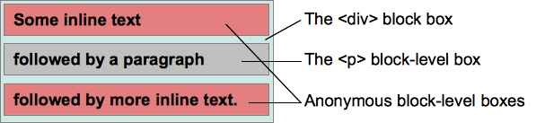

#可视化格式模型（Visual formatting model）
---
[英文原版点击这里](http://dev.w3.org/csswg/css2/visuren.html)

##1. 可视化格式模型介绍（Introduction to the visual formatting model）

本章和[下一章](可视化格式模型细节.md)描述可视化格式模型：浏览器怎样将文档树处理为可视化网页。

CSS 视觉格式化模型(visual formatting model)是用来处理文档并将它显示在视觉媒体上的机制。这是 CSS 的一个基础概念。 视觉格式化模型根据 CSS 盒模型为文档的每个元素生成 0，1 或多个盒。每个盒的布局由如下内容组成：

- 盒尺寸：明确指定，受限或没有指定
- 盒类型：行内(inline), 行内级别(inline-level), 原子行内级别(atomic inline-level), 块(block)盒；
- 定位方案(positioning scheme): 常规流，浮动或绝对定位；
- 树中的其它元素: 它的子代与同代；
- 视口(viewport) 尺寸与位置；
- 内含图片的固定尺寸；
- 其它信息。

一个盒相对于它的包含块(containing block) 的边界来渲染。通常盒为它的后代元素建立包含块。注意盒并不受它的包含块的限制，当它的布局跑到包含块的外面时称为溢出(overflow)。

视觉可视化模型并没有提供所有方面的格式，比如没有提供字母间距算法，这些格式在不同的浏览器上可能存在不同的格式。

###1.1 视口（The viewport）

浏览器窗口。

###1.2 包含块（Containing blocks）

在CSS2.1中，许多盒子的定位和尺寸都是根据一个叫做包含块的矩形框的边缘计算的。一般来说，盒子是它后代盒子的包含块。 我们说一个盒子的包含块是指这个盒子所在的包含块。

每个盒子根据它的包含块定位，但盒子不限制在包含块中，它可能是溢出的。

##2. 控制包含框的生成（Controlling box generation）
这一节描述CSS2.1中盒子的类型。一个盒子的类型在某种程度上影响它在视觉可视化模型中的表现。使用display指定盒子类型。

使用display的某个确定值能为源文档中的元素生成一个包含后代盒子和内容的主盒，这个主盒也是参与到任何定位方案中的那个盒子。像list-item这种display会生成额外的盒子，以便容纳多余的内容。

###2.1 块级元素（Block-level elements）和块盒（block boxes）

块级元素-那些在源文档中被格式化为block的元素-会生成一个块级主盒。能使元素变为块级的属性包括：block,list-item,table。块级盒子参与BFC。

在CSS2.1中，块级盒子也是块容器，除非这个盒子是table或者是替换元素的主盒。块容器要么包含块级盒子，要么创建IFC用来包含行内级盒子。一个元素的主盒如果是块容器，那么这个元素是块容器元素。display为block,list-item,inline-block时可以使一个非替换元素生成一个块容器。不是所有的块容器都是块级盒子：非替换行内块和非替换table cell是块容器但不是块级盒子。如果一个盒子既是块级盒子又是块容器那这个盒子就叫做块盒子。

####2.1.1 匿名块盒子（Anonymous block boxes）

有时需要添加补充性盒，这些盒称为匿名盒(anonymous boxes),  它们没有名字，不能被 CSS 选择符选中。

不能被 CSS 选择符选中意味着不能用样式表添加样式。这意味着所有继承的 CSS 属性值为 inherit ，所有非继承的 CSS 属性值为 initial 。

块容器盒要么只包含行内级盒，要么只包含块级盒。但通常文档会同时包含两者。在这种情况下，将创建匿名块盒来包含毗邻的行内级盒。

拿下面的 HTML 代码来说 ( <div\> 与 <p\> 使用默认属性 display:block )

	

		Some inline text 
		
followed by a paragraph
 
		followed by more inline text.
	

将创建两个匿名块盒，一个包含 <p\> 前面的文本 (Some inline text)， 一个包含 <p\> 后面的文本(followed by more inline text),  结构如下:

> 结果：
> 
> 1. Some inline text
> 2. followed by a paragraph
> 3. followed by more inline text.

和 <p\> 元素不同, 开发者不能控制这两个匿名盒。对于可继承属性， 它们将取 <div\> 的属性值, 比如 color。对于非继承属性，值为初始值 ，比如没有指定 background-color, 值为初始值即 transparent，于是 <div\> 背景可见。而 <p\> 可以指定 background-color 。类似的，这两个匿名盒文本是一样的颜色。

###2.2 行内级别元素和行内盒子（Inline-level elements and inline boxes）

行内元素是那些源文档中不产生块级内容的元素。内容分布在行中。display为inline,inline-table,inline-block时元素是行内级别的。行内级别元素生成行内级别盒子，参与IFC。

行内盒子不仅是行内级别的，而且他的内容参与他包含的IFC。display为inline的非替换元素生成行内盒子，不是行内级别盒子的行内盒子被叫做原子行内级别盒子，因为他被当做单独的不透明盒子参与到IFC中。

####2.2.1 匿名行内盒子（Anonymous inline boxes）

类似于块盒，CSS 引擎有时自动生成行内盒。这些盒也是匿名的，因为它们没有对应的选择器名字。它们继承所有可继承的属性，非继承的属性取 initial。 

匿名行内盒最常见的例子是块盒直接包含文本，文本将包含在匿名行内盒中。空白如果使用white-space 去掉，则不会生成匿名行内盒。

###2.3 Run-in盒子（Run-in boxes）

被移动到CSS3规范中。

###2.4 display属性（The 'display' property）

<table style="border-collapse: collapse">
<tbody>
<tr>
<td>
<b>值</b>
</td>
<td>
<b>含义</b>
</tr>
<tr>
<td>block</td>
<td>让元素生成一个块盒子</td>
</tr>
<tr>
<td>inline-block</td>
<td>让元素生成一个行内级别的块容器（元素内部被格式化成块盒子，元素本身被格式化成原子行内级别元素）</td>
</tr>
<tr>
<td>inline</td>
<td>让元素生成一个或多个行内盒子</td>
</tr>
<tr>
<td>list-item</td>
<td>让元素生成一个主块框和一个marker box（看上去就是用来容纳list前面的点的）</td>
</tr>
<tr>
<td>none</td>
<td>让元素不出现在格式结构中，这个行为不能通过设置后代的display重置</td>
</tr>
<tr>
<td>
table, inline-table, table-row-group, table-column, table-column-group, table-header-group, table-footer-group, table-row, table-cell, and table-caption
</td>
<td>
让元素的行为看上去像table元素
</td>
</tbody>
</table>

计算的值和提供的值是一致的，除非是定位元素、浮动元素和根元素。对于根元素，计算的值会按照 relationships between 'display', 'position', and 'float'. 这一节中描述的情况改变。

注意，display的初始值是inline，浏览器中的默认规则可能会重写这个值。

##3. 定位方案（Positioning schemes）

CSS2.1中有三种定位方案：

- 正常流

	正常流包括块级盒子的块格式化；行内级别盒子的行内格式化；块级盒子和行内级别盒子的相对定位。
 
- 浮动
 
	在浮动模型中，盒子首先按照正常流放置，然后从正常流中脱离并向左或右移动尽可能的远。

- 绝对定位

	元素从正常流中完全移除然后根据包含块分配一个位置。

当元素是浮动的或绝对定位的，我们说这个元素不在流中，或者这个元素是根元素。除了上述情况，元素都在流中。The flow of an element A is the set consisting of A and all in-flow elements whose nearest out-of-flow ancestor is A.

###3.1 position属性（Choosing a positioning scheme: 'position' property）

<table style="border-collapse: collapse">
<tbody>
<tr>
<td>
<b>值</b>
</td>
<td>
<b>含义</b>
</tr>
<tr>
<td>static</td>
<td>盒子根据正常流放置，'top', 'right', 'bottom', 'left'不可用</td>
</tr>
<tr>
<td>relative</td>
<td>
盒子的位置根据其在正常流中的定位计算，然后根据正常位置偏移。如果一个盒子B是相对定位的，它后面的盒子在定位时会根据B的正常位置计算。
</td>
</tr>
<tr>
<td>absolute</td>
<td>
盒子的位置由 'top', 'right', 'bottom', 'left'属性提供，这些属性根据盒子的包含块计算偏移。绝对定位元素被移除出正常流，也就是说它放置时后面的兄弟元素当它不存在。而且，绝对定位的盒子有margin，但是不和任何margin合并。
</td>
</tr>
<tr>
<td>fixed</td>
<td>
盒子的定位方法和absolute一样，但是是根据浏览器窗口而不是包含块计算偏移，并且滑动视口时不移动。
</td>
</tr>
</tbody>
</table>

用户代理可能把根元素的position视作static。

###3.2 盒偏移量：'top', 'right', 'bottom', 'left'（Box offsets: 'top', 'right', 'bottom', 'left'）

<table style="border-collapse: collapse">
<tbody>
<tr>
<td>
<b>值</b>
</td>
<td>
<b>含义</b>
</tr>
<tr>
<td>top</td>
<td>
盒子如果是绝对定位，top就是盒子上外边距边界到包含块上边界的偏移量。
盒子如果是相对定位，就根据盒子在正常定位时的位置偏移。
</td>
</tr>
<tr>
<td>right</td>
<td>
与top类似。
</td>
</tr>
<tr>
<td>bottom</td>
<td>
与top类似。
</td>
</tr>
<tr>
<td>left</td>
<td>
与top类似。
</td>
</tr>
</tbody>
</table>

以上属性有下面四种值类型：

- 长度

- 百分比

	相对包含块（几乎就是父元素）的宽度或高度的百分比。

- auto

	后面说。

##4. 正常流（Normal flow）

正常流中的盒子属于一个格式化上下文，这个上下文在CSS2.1中可能是table，block，inline。块级盒子参与块格式化上下文，行内级盒子参与行内格式化上下文，表格格式化上下文在[表格章节](http://dev.w3.org/csswg/css2/tables.html)描述。

###4.1 块级格式化上下文（BFC）

块格式化上下文block formatting context 是页面 CSS 视觉渲染的一部分。它是用于决定块盒子的布局及浮动相互影响范围的一个区域。

下列情况将创建一个块格式化上下文：

- 根元素或其它包含它的元素
- 浮动 (元素的 float 不为 none)
- 绝对定位元素 (元素的 position 为 absolute 或 fixed)
- 内联块 inline-blocks (元素的 display: inline-block)
- 表格单元格 (元素的 display: table-cell，HTML表格单元格默认属性)
- 表格标题 (元素的 display: table-caption, HTML表格标题默认属性)
-  overflow 的值不为 visible的元素
- 弹性盒 flex boxes (元素的 display: flex 或 inline-flex，设计CSS3规范)

块格式化上下文包括了创建该上下文的元素的所有子元素，但不包括创建了新的块格式化上下文的子元素。

块格式化上下文对定位 (参见 float) 与清除浮动 (参见 clear) 很重要。定位和清除浮动的样式规则只适用于同一块格式化上下文中的元素。浮动不会影响其它块格式化上下文中元素的布局，清除浮动只清除同一块格式化上下文中，在它前面的元素的浮动

###4.2 行内格式化上下文（Inline formatting contexts）

又长又无聊

###4.3 相对定位（Relative positioning）

如果left和right都是auto（默认值），使用值是0。

如果left是auto，根据right偏移。

反之根据left偏移。

如果两个值都不是auto，忽略一个，对于从左往右阅读的语言，使用left的偏移值。

在top和bottom中，当两个只都存在时，bottom被忽略。

##5. 浮动（Floats）

