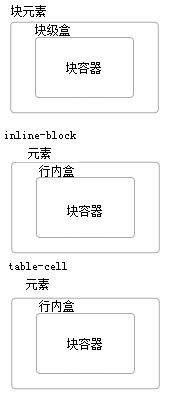
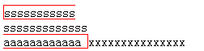

### 9.2.1 块级元素（block-level elements）和块盒（block boxes）

`块级元素`可以通过设置元素的display为“block”，“list-item”和“table”来创建，当然有些元素天生是块级元素，比如p。块级元素会生成`块级盒子`，当然有些元素不仅仅生成一个盒子，像list-item还会生成额外的盒子用来存放列表前面的点。块级盒在很多情况下也是`块容器`，块容器可以存放块级盒或者行内盒，二者选其一，注意如果块容器存放行内盒的话首先需要创建IFC，然后由IFC容纳行内盒。像inline-block和table-cell是块容器，但不是块级盒（他们为什么是块容器？因为他们可以容纳块级盒或者行内盒）。块盒是指那些是块容器的块级盒。像下图中第一个盒就是块盒。

#### 9.2.1.1 匿名块盒（anonymous block boxes）

- 如果一个块容器内部有一个块级盒，那么我们强制它的内部必须只能有块级盒。如下代码所示：

		

		    some text
			<a>other text<a/>
		    
more test
		

		我在下一行显示

	some text和a被包裹了匿名块级盒，它是不能被选择器选中的，所以只有继承能继承的属性，不能继承的用默认值。整体上div是一个块盒，它后面的兄弟盒子会换行。

	注意a本身还是行内元素，只是被匿名块级盒包裹，它的BFC还是div

- 如果一个行内盒中有一个块级盒，那么块级盒两边的文本被截断，截断的文本被匿名块盒包裹，行内盒还是行内盒，但是line box的高度可能会改变。在下图中，xxx是p的兄弟元素，和p在同一行。

		

	        sssssssssss
	        sssssssssssss
	        aaaaaaaaaaaa
	    

	    
	        xxxxxxxxxxxxxxx
	    

	

当解析百分比值时匿名块盒将被忽略而使用最接近的非匿名祖先盒

在引起匿名块盒生成的元素上设置的属性也作用于这些匿名块盒和它的内容。例如，在上面的例子中，如果给P元素设置border，border将围在C1（结尾的线是开的）和C2（起始的线是开的）周围。

### 9.2.2 行内级元素（inline-level elements）和行内盒（inline boxes）

`行内级元素`是指源文档中不为内容生成新块的那些元素；内容被分配在一行（例如，一个段落中的强调部分，行内图片等等），如果宽度不够也会换行。display为“inline”，“inline-table”，和“inline-block”的元素是行内级元素。行内级元素生成`行内级盒`，这些盒处于一个行内格式化上下文中。

display为“inline”的非替换元素生成一个`行内盒`。可替换行内元素（img），inline-block，inline-table是行内级盒但不是行内盒。

####　9.2.1.1 匿名行内盒（anonymous inline boxes）

直接包含在一个块容器（不是包含在一个行内元素）内的文本必须被当作一个匿名行内元素。

	
some <em>emphasized</em> text

`
`生成一个块盒，内部包含了一些行内盒。包含“emphasized”文本的盒子是一个通过行内元素（`<em>`）生成的行内盒，而其他的盒子（“some”和“text”）是通过块级元素（`
`）生成的行内盒，因为它们没有一个与之相关联的行内级元素。

空白内容将根据“white-space”的属性值依次被折叠而不会生成任何匿名行内盒。

>译注：这节的行内盒与匿名行内盒也是控制盒的范畴。

### 9.2.3 run-in boxes
移动到CSS3中

### 9.2.4 “display”属性
*“display”*
>value: `inline`|`block`|`list-item`|`inline-block`|`table`|`inline-table`|`table-row-group`|`table-header-group`|`table-footer-group`|`table-row`|`table-column-group`|`table-column`|`table-cell`|`table-caption`|`none`|`inherit`

>initial: `inline`

>applies to: all elements

>inherited: no

>percentages: N/A

>media: `all`

>computed value: see text

---
重点内容：

* 块级盒：由块级元素生成，处于块格式化上下文（BFC）中，以块方式布局
* 块容器盒：只能包含块级盒或者建立行内格式化上下文（IFC）来包含行内级盒。
* 块盒：既是块级盒又是快容器盒
* 匿名块盒：为了满足快容器的布局要求而定义出来的一种不具名的块盒
* 行内盒：行内级的，并处于行内格式化上下文（IFC）中，以行内方式布局
* 匿名行内盒：直接包含在块容器盒中的文本被当作是一个匿名行内盒。
* 一个匿名盒是匿名行内盒或者是匿名块盒跟它所属的上下文相关（块级或者行内，这个快容器布局条件中只能包含块级盒或者只能包含行内盒相关联）。
* 本章讲的所有盒子相关的术语（上面这些）都属于控制盒的范畴。
