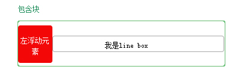
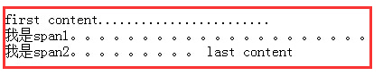
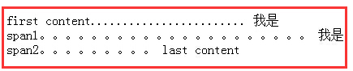
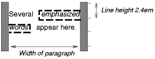

正常流中的盒属于一个格式化上下文（formatting context），可能是块或者行内，但不能两者都是。块级盒处于一个块级格式化上下文（block formatting context）中。行内盒处于一个行内格式化上下文（inline formatting context）中。

### 9.4.1 块格式化上下文（block formatting context）

浮动，绝对定位元素，不是块盒的块容器（例如inline-blocks, table-cells和table-captions）和拥有除了“visible”以外值的“overflow”属性的块盒会为它们的内容建立一个新的块格式化上下文。

在一个块格式化上下文中，盒从包含块顶部开始，按垂直方向一个接一个进行布局。两个相邻兄弟盒之间的垂直距离由“margin”属性决定。在块格式化上下文中紧邻的块级盒之间的垂直margin会折叠。

在一个块格式化上下文中，每个盒的左外边缘和包含块的左边缘对齐。这甚至对于浮动元素也是如此，除非这个盒子建立一个新的块格式化上下文。

### 9.4.2 行内格式化上下文（inline formatting context）
在一个行内格式化上下文中，盒从包含块的顶部开始，按水平方向一个接一个进行布局。这些盒子之间的水平方向的margin，borders和padding被考虑。盒可以在垂直方向上按照不同的方式对齐：按照它们的底部或者顶部对齐，或者按照他们内部的文本基线（baseline）对齐。把这些盒子组成为一行的那个矩形区域叫做`line box`（行盒）。

line box的宽度取决于包含块和浮动的存在。line box的高度取决于本章[行高的计算](https://github.com/Heboy/note4css/blob/master/CSS2.1/%E7%AC%AC%E5%8D%81%E7%AB%A0%20%E8%A7%86%E8%A7%89%E5%8F%AF%E8%A7%86%E5%8C%96%E6%A8%A1%E5%9E%8B%E7%BB%86%E8%8A%82/10.8-%E8%A1%8C%E9%AB%98%E7%9A%84%E8%AE%A1%E7%AE%97%EF%BC%9A%E2%80%9Cline-height%E2%80%9D%E5%92%8C%E2%80%9Cvertical-align%E2%80%9D%E5%B1%9E%E6%80%A7.md)中给出的规则。

一个line box对于它包含的所有盒总是足够高的。而且，它也可能高于它包含的盒中最高的那个。当一个盒B的高度小于包含它的line box的高度时，B在这个line box中的垂直方向对齐方式取决于“vertical-align”属性。当几个行内级盒无法在一个line box中水平放置的时候，它们被分到两个或者更多的垂直的line box。line box被紧密的堆叠（除非特别声明）但永远不会重叠。

一般来说，一个line box的左边缘和它的包含块的左边缘对齐而且它的右边缘和包含块的右边缘对齐。但是，浮动的盒会在包含盒的边缘和line box的边缘之间。在下图中，line box因为浮动的存在所以不能和包含块一样宽。

- 行内盒子比line box小的时候，行内盒子在一行放置，可以通过text-align设置对齐（但inline-table和inline-block盒不会）。

- 当一个行内盒超出一个line box的宽度，它被分割成多个盒并且这些盒被分配到多个line box中。如果一个行内盒无法被分割（例如，如果这个行内盒包含了一个字符，或者语言中规定的单词折断规则不允许它在行内盒中被折断，或者如果这个行内盒被一个white-space为nowrap的值所影响，或者是一个pre），那么行内盒会溢出line box。举个例子：

	 	
		...
		

	        first content........................
	        我是span1。。。。。。。。。。。。。。。。。。。。。
	        我是span2。。。。。。。。。
	        last content
	    

line box是p生成的，如果够长，所有内容在一行显示，如果不够长，span1，span2，last content都有可能被换行，注意样式中的white-space: nowrap，没这个，span1，span2的内容会折断以适应新的line box，效果如下图所示：

	
	

当一个行内盒被分割开，margins，borders和padding在分割发生的地方被忽略（没有视觉效果）。

由于双向文本处理方式（bidirectional text processing），相同line box中的行内盒也可能被分割成多个盒。

line box被按需创建用于保持行内级内容在一个行内格式化上下文中。

考虑下面的例子：

	<!DOCTYPE HTML PUBLIC "-//W3C//DTD HTML 4.01//EN">
	<HTML>
	  <HEAD>
	    <TITLE>Example of inline flow on several lines</TITLE>
	    
	  </HEAD>
	  <BODY>
	    
Several <EM>emphasized words</EM> appear here.

	  </BODY>
	</HTML>

依赖p的宽度，盒子将按照下面的方式分配：

* margin被插入在“emphasized”的前面和“words”的后面。
* padding被插入在“emphasized”的前面，上面，下面和“words”的后面，上面和下面。虚线被渲染在每一分割盒的三边上。

### 9.4.3 相对定位

当一个盒子根据正常流或者浮动布局的时候，它的位置可以相对于这个位置被改变。称为相对定位。用下面的方法偏移一个盒子（B1）时，对盒子（B2）没有影响： B2被赋予一个在B1没有偏移时的那个位置，并且B2在B1的偏移量应用之后没有被重新定位。这表明相对定位可能导致盒子重叠。尽管如此，如果相对定位造成一个“overflow：auto”或者“overflow：scroll”的盒子溢出，浏览器必须允许用户访问这个内容（在它的偏移位置），也就是，通过创建滚动条，这也许会影响布局。 

相对定位的盒子保持他的正常流的大小，包括为它保留的原始断行和空白。[包含块](https://github.com/acelan86/css/wiki/9.1-%E5%8F%AF%E8%A7%86%E5%8C%96%E6%A0%BC%E5%BC%8F%E6%A8%A1%E5%9E%8B%E4%BB%8B%E7%BB%8D%EF%BC%88done%EF%BC%89#912-containing-blocks)这个章节说明了何时一个相对定位盒子会建立一个新的包含块。

> 注意：在脚本环境中，相对定位盒子的动态移动能产生动画效果 （见“visibility”属性）。相对定位可以用来产生上标和下标的效果, 行高并不会根据位置自动调整。更多信息可以查看行高的计算。

---
BFC的特点：

* 盒子从包含块顶部开始一个接一个地垂直放置
* 两个兄弟框之间的垂直距离取决于margin
* 相邻的块级元素的垂直外边距会折叠
* 块格式化上下文可嵌套

为内容生成新的块格式化上下文的条件：

* 浮动元素
* 绝对定位元素
* 根元素
* 行内块元素
* 单元格
* 表格标题元素
* overflow属性值为非visible的元素

IFC的特点

* 行内盒子从顶部开始，在水平方向上一个接一个放置（取决于ltr或者rtl）
* 处于同一行的行内盒构成的矩形框称为行盒，行盒足够高以容纳行内所有的行内盒，且可能比所有盒子都高
* 行盒内盒子的垂直对齐方式有vertical-align决定，水平方向对齐方式由text-align决定
* 如果一个行盒内无法容纳所有内容，行内盒将被切分成多个行内盒，分布在多个行盒中，形成一个行盒的堆叠，每个行盒是紧密排列的。
* 规范中不能被拆分的元素会溢出行盒而不被切割

