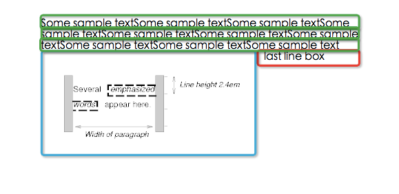

[上一节](9.4-正常流.md)

一个浮动盒被移动到左边或者右边直到它的外边缘接触到包含盒的边缘或者他的外边缘接触到另外一个浮动元素。如果在一个line box中，浮动盒的外顶部和当前line box的顶部对齐。

如果没有足够的水平空间容纳浮动元素，它会往下（类似换行）直到有合适的空间放置或者不再有浮动元素存在。

因为浮动元素不在流中，非定位块盒会在浮动盒的前后垂直放置，就像浮动元素不存在一样。但是，紧邻浮动元素创建的当前和随后的line box必须被缩短以便腾出空间存放浮动盒。这里的当前line box是指浮动元素所在的line box，随后的line box是指在当前line box之后创建的line box。

例如，在下面的文档片段中，包含块太窄以至于无法包含和浮动元素相邻的内容，因此内容被移动到浮动元素的下面，看这里文本还溢出了。它在line box中的对齐取决于`text-align`属性。

	p { width: 10em; border: solid aqua; }
	span { float: left; width: 5em; height: 5em; border: solid blue; }
	...
	

	   
	  Supercalifragilisticexpialidocious
	

这个片段看起来像这样：

思考下面的HTML源代码和样式表：

	<!DOCTYPE HTML PUBLIC "-//W3C//DTD HTML 4.01//EN">
	<HTML>
	  <HEAD>
	    <TITLE>Float example</TITLE>
	    
	  </HEAD>
	  <BODY>
	    

	       Some sample text that has no other...
	  </BODY>
	</HTML>

IMG盒被浮动到左边。随后的内容被格式化到浮动元素的右边，从与浮动元素相同的行开始。由于浮动元素的存在，浮动右边的line box太短，但在浮动的后面回到它们的“normal（正常）”宽度（P元素建立的包含块的宽度）。这个文档可能被像下面那样格式：

如果文档是下面这样，格式化将会完全一致（不一致好嘛！这个例子中文本的line box处在浮动元素之前，根据上面的规则，只有浮动元素当前和之后的line box才会缩短，所以本例中当line box不够宽时，浮动换行）：

	<BODY>
	  
Some sample text 
	  
	           that has no other...
	  

	</BODY>

这里有另外一个图例, 展现了正常流中一个浮动元素覆盖元素border的时候的情况。

一个浮动的图片遮盖了和它重叠的块盒的边框。

下面的例子表明“clear”属性的用法，用来防止内容紧随一个浮动元素放置。

假定一个像这样的规则：

	p{clear: left}

格式化结果看起来像这样：

两个段落都被设置了“clear：left”属性，这导致了第二个段落被“往下推”到浮动元素的下方——“空隙”被添加到它的上margin处以达到这个效果（见“clear”属性）。

### 9.5.1 定位浮动元素：“float”属性
*“float”*
>Value:  	`left` | `right` | `none` | `inherit`

>Initial:  	`none`

>Applies to:  	all, but see 9.7

>Inherited:  	no

>Percentages:  	N/A

>Media:  	`visual`

>Computed value:  	as specified

本属性描述了一个盒子左浮，右浮或者什么都不做。它可以被设置到任何元素中，但只在元素生成的盒子不是[绝对定位](http://www.w3.org/TR/CSS21/visuren.html#absolutely-positioned)的情况下生效。

用户代理对根元素上的“float”属性以“none”对待。

这里有一些控制浮动元素行为的精确规则：

1. 一个左浮盒子的左外边缘不会在它的包含块的左边缘的左边。右浮元素也保持相似的规则。

2. 如果当前的盒子是左浮的，且源文档中存在较早的生成的左浮的盒子的元素，那么对于每一个这样的早期盒子，当前盒子的左外边必须在这个早先的盒子的右外边缘的右边，或者它的顶部必须低于早先的盒子的底部。右浮盒子也保持相似的规则。

3. 一个左浮盒子的右外边缘不能在任何与它相邻的右浮元素的左外边缘的右边。右浮元素也保持相似的规则。

4. 一个浮动盒子的外顶部不能比它的包含盒更高。当浮动在两个折叠的margin间发生的时候，浮动元素的定位就像它拥有另外一个空的父级匿名块。这样一种父级定位在margin collapsing这个章节定义。
 
5. 一个浮动盒的外顶部不能高于任何块或者由源文档中更早的元素生成的浮动盒的外顶部。

6. 浮动盒的外顶部不能比它之前元素生成的行盒的外顶部更高。比如如下代码：

		

		    
		        ssssssssssssssssssssssssssssssssssss
		    
		    

		        aaaaaaaaaaaaaaa
		    

		

如果span的内容不够多，那么div和span在同一行，不超过span的外顶部的高度（这里是等于），如果span的内容很多，以至于span沾满一行，那么div换行！所以在做文字环绕图片的时候，img必须在文本盒子的左边，不然就会出现下图所示的情况：

7. 左边有另外一个左浮盒子的左浮盒子的右外边缘不能在它的包含块的右边缘的右边。（不严格的说：一个左浮元素不能超出右边缘，除非它已经尽可能的的放在左边。）右浮元素也保持相似的规则。

8. 浮动盒必须尽可能的往高处放。

9. 左浮盒子必须尽可能的放在左边，右浮盒子必须尽可能的放在右边。一个更高的位置优先分配给距离左/右更远的元素。

在这些规则中其他元素的说明只适用于在相同块格式化上下文中浮动的元素。

这个HTML片段的结果是b浮动到右边。

	
ab

如果p元素足够宽，a和b将并排，看起来就像这样：

否则像这样：

### 9.5.2 紧邻浮动元素的控制流：“clear”属性

*“clear”*
>Value:  	`none` | `left` | `right` | `both` | `inherit`

>Initial:  	`none`

>Applies to:  	block-level elements

>Inherited:  	no

>Percentages:  	N/A

>Media:  	visual

>Computed value:  	as specified

**left**：盒子的top border边缘低于源文档中在它前面的任何左浮动盒子的bottom 外边缘（也就是margin bottom边缘）下方。

**right**：规则与left相似。

**both**：规则与left相似。

“`clear`”属性不考虑在元素自身内部或者在其它块格式化上下文中的浮动元素。

除“none”外的值潜在的引入了间隙，也就是clearance。

间隙处于margin-top之上，会阻止margin折叠并且推动元素垂直于浮动元素下方。

一个“clear”元素被设置的间隙可以通过先确定元素上边框边缘的假定位置，即元素的“clear”属性被设置为“none”时的上外边框边缘来计算。

>注意：间隙可以是负值或者0。

例子：这是一个负间隙的例子，间隙是-1em。（假设元素都没有border或者padding）：

	

	  First paragraph.
	
	

	  Floating paragraph.
	
	

	  Last paragraph.

解释：不用“clear”，第一个和最后一个段落的margin将折叠而且最后一个段落的border-top将和浮动元素的border-top对齐，如下图所示：

使用clear的话上边框边缘在浮动元素的下面。这意味着间隙必须引入。如下图：first paragraph的margin-bottom不能与last paragraph的margin-top合并，并且last paragraph必须在float paragraph的下面，所以：

	clearance + margin-top(last paragraph) = 2em，
	clearance = 2em - 3em = -1em

当这个属性被设置到浮动元素时，它导致浮动定位规则的一个变更。一个额外的约束被添加进来：

* 浮动的外顶部边缘必须在所有比它早的左浮盒子的外底部边缘的下方（“clear：left”的情况），或者所有比它早的右浮盒的下方（“clear：right”的情况），或者两中情况（“clear：both”）。

[下一节](9.7-“display”，“position”，“float”之间的关系.md)
