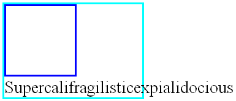
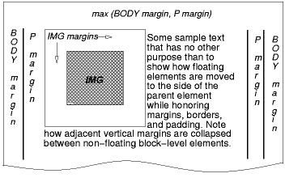
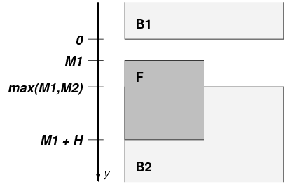

笔记：通篇需要了解两个部分，一是float的浮动规则，二是clear在浮动和非浮动元素上的效果。
其他文绉绉的部分看上去只是为了严谨。

一个浮动盒被移动到左边或者右边直到它的外边缘接触到包含盒的边缘或者他的外边缘接触到另外一个浮动元素。如果在一个line box（理解为一整行，叫box所以具有margin，padding，border属性）中，浮动盒的外顶部和当前line box的顶部对齐。

如果没有足够的水平空间容纳浮动元素，它会往下直到有合适的空间放置或者不再有浮动元素存在。

因为浮动元素不在流中，非定位块盒会在浮动盒的前后垂直放置，就像浮动元素不存在一样。但是，紧邻浮动元素创建的当前和随后的line box必须被缩短以便腾出空间存放浮动盒。

例子。在下面的文档片段中，包含块太窄以至于无法包含和浮动元素相邻的内容，因此内容被移动到浮动元素的下面，看这里文本还溢出了。它在line box中的对齐取决于`text-align`属性。

	p { width: 10em; border: solid aqua; }
	span { float: left; width: 5em; height: 5em; border: solid blue; }
	...
	

	   
	  Supercalifragilisticexpialidocious
	

这个片段看起来像这样：

下面的规则通过class=“icon”将所有的img盒浮动到左边（并且设置margin为0）：

	img.icon { 
	  float: left;
	  margin-left: 0;
	}

思考下面的HTML源代码和样式表：

	<!DOCTYPE HTML PUBLIC "-//W3C//DTD HTML 4.01//EN">
	<HTML>
	  <HEAD>
	    <TITLE>Float example</TITLE>
	    
	  </HEAD>
	  <BODY>
	    

	       Some sample text that has no other...
	  </BODY>
	</HTML>

IMG盒被浮动到左边。随后的内容被格式化到浮动元素的右边，从与浮动元素相同的行开始。由于浮动元素的存在，浮动右边的line box太短，但在浮动的后面（译注：这里指这个浮动不再占据空间的那个地方）回到它们的“normal（正常）”宽度（P元素建立的包含块的宽度）。这个文档可能被像下面那样格式：

如果文档是下面这样，格式化将会完全一致（不一致好嘛！原因见下方规则）：

	<BODY>
	  
Some sample text 
	  
	           that has no other...
	</BODY>

因为浮动元素左边的内容沿着浮动元素显示并且从它的右边重新向下排布。

>译注：这里应该是有前提的，即如果浮动前面的文本内容只有一行，且水平空间除去浮动后足够在一行内容纳这个文本的情况下，两个写法的布局精确的一致，
>或者这里的意思只是它们的格式化方法一致，并不是说展现后的结果一致。

这里有另外一个图例, 展现了正常流中一个浮动元素覆盖元素border的时候的情况。

一个浮动的图片遮盖了和它重叠的块盒的边框。

下面的例子表明“clear”属性的用法，用来防止内容紧随一个浮动元素放置。

假定一个像这样的规则：

	p{clear: left}

格式化结果看起来像这样：

[D](http://www.w3.org/TR/CSS21/images/longdesc/floatclear-desc.html)

两个段落都被设置了“clear：left”属性，这导致了第二个段落被“往下推”到浮动元素的下方——“空隙”被添加到它的上margin处以达到这个效果（见“clear”属性）。

### 9.5.1 定位浮动元素：“float”属性
*“float”*
>Value:  	`left` | `right` | `none` | `inherit`

>Initial:  	`none`

>Applies to:  	all, but see 9.7

>Inherited:  	no

>Percentages:  	N/A

>Media:  	`visual`

>Computed value:  	as specified

本属性描述了一个盒子左浮，右浮或者什么都不做。它可以被设置到任何元素中，但只在元素生成的盒子不是[绝对定位](http://www.w3.org/TR/CSS21/visuren.html#absolutely-positioned)的情况下生效。这个属性的值的意义如下：

*left*
元素生成一个浮动到左边的[块盒](http://www.w3.org/TR/CSS21/visuren.html#block-boxes)。内容从盒子的顶部，在盒子的右侧排布。

*right*

和“left”类似，除了盒子是浮动到右边，内容从盒子的顶部起，在盒子的左侧排布。

*none*

盒子不浮动。

用户代理对根元素上的“float”属性以“none”对待。

这里有一些控制浮动元素行为的精确规则：

1. 一个左浮盒子的左外边缘不会在它的包含块的左边缘的左边。右浮元素也保持相似的规则。

2. 如果当前的盒子是左浮的，且源文档中存在较早的生成的左浮的盒子的元素，那么对于每一个这样的早期盒子，当前盒子的左外边必须在这个早先的盒子的右外边缘的右边，或者它的顶部必须低于早先的盒子的底部。右浮盒子也保持相似的规则。

3. 一个左浮盒子的右外边缘不能在任何与它相邻的右浮元素的左外边缘的右边。右浮元素也保持相似的规则。

4. 一个浮动盒子的外顶部不能比它的包含盒更高。当浮动在两个折叠的margin间发生的时候，浮动元素的定位就像它拥有另外一个空的父级匿名块。这样一种父级定位在margin collapsing这个章节[定义](http://www.w3.org/TR/CSS21/box.html#collapsed-through)。

5. 一个浮动盒的外顶部不能高于任何块或者由源文档中更早的元素生成的浮动盒的外顶部。

6. 浮动盒的外顶部不能比它之前元素生成的行盒的外顶部更高。比如如下代码：

		

		    
		        ssssssssssssssssssssssssssssssssssss
		    
		    

		        aaaaaaaaaaaaaaa
		    

		

如果span的内容不够多，那么div和span在同一行，不超过span的外顶部的高度（这里是等于），如果span的内容很多，以至于span沾满一行，那么div换行！所以在做文字环绕图片的时候，img必须在文本盒子的左边，不然就会出现下图所示的情况：

7. 左边有另外一个左浮盒子的左浮盒子的右外边缘不能在它的包含块的右边缘的右边。（不严格的说：一个左浮元素不能超出右边缘，除非它已经尽可能的的放在左边。）右浮元素也保持相似的规则。

8. 浮动盒必须尽可能的往高处放。

9. 左浮盒子必须尽可能的放在左边，右浮盒子必须尽可能的放在右边。一个更高的位置优先分配给距离左/右更远的元素。

但在CSS2.1中，如果，在一个块格式化上下文中，存在一个流内拥有垂直方向margin为负值的元素，那么浮动元素的位置在它原本的那个位置的之上，就是所有这些负margin的元素设置成0的时候的位置，浮动元素的位置是未定义的。

>>ut in CSS 2.1, if, within the block formatting context, there is an in-flow negative vertical margin such that the float's position is above the position it would be at were all such negative margins set to zero, the position of the float is undefined.

>后半句啥意思？

在这些规则中其他元素的说明只适用于在相同块格式化上下文中浮动的元素。

这个HTML片段的结果是b浮动到右边。

	
ab

如果p元素足够宽，a和b将并排，看起来就像这样：

否则像这样：

### 9.5.2 紧邻浮动元素的控制流：“clear”属性

*“clear”*
>Value:  	`none` | `left` | `right` | `both` | `inherit`

>Initial:  	`none`

>Applies to:  	block-level elements

>Inherited:  	no

>Percentages:  	N/A

>Media:  	visual

>Computed value:  	as specified

这个属性指明了一个元素的盒子的哪一边不和更早的浮动盒子相邻。“`clear`”属性不考虑在元素自身内部或者在其它块格式化上下文中的浮动元素。

当将下面的值应用于非浮动块级盒的时候它们的含义如下：

`left`
要求盒子的上边框边缘在任何源文档中比这个盒子早的元素引起的左浮盒的外底部边缘的下面。

`right`
要求盒子的上边框边缘在任何源文档中比这个盒子早的元素引起的右浮盒的外底部边缘的下面。

`both`
要求盒子的上边框边缘在任何原文档中比这个盒子早的元素引起的左浮或者右浮盒子的外底部边缘下面。

`none`
对盒子与浮动元素相关的位置没有做约束。

除“none”外的值潜在的引入了间隙。间隙阻止margin折叠并且承担了一个元素的上margin上面的空间的角色。它被用来垂直推动元素超过浮动元素。

一个“clear”元素被设置的间隙可以通过先确定元素上边框边缘的假定位置，即元素的“clear”属性被设置为“none”时的上外边框边缘来计算。

如果这个元素的上边框边缘的这个假定位置没有超过相关的浮动元素，那么间隙被引入，而且margin折叠依据8.3.1的规则实行。

然后间隙的总大小被设置成下面描述中最大的那个：

1. 总大小必须至少将被清除的最低的那个浮动元素的外底部边缘作为盒子的边框边缘。

2. 总大小必须把块上边框边缘放在它的假定位置中。

作为一种选择，间隙精确的被设置到总大小必须把块的边框边缘放置在被清除的最低的那个浮动元素的外底部边缘下面。

>注意：两种行为都允许对存在的web内容的兼容性进行不定求值（pending evaluation）。未来的CSS规范将要求是其中的一种或者另外一种。

>注意：间隙可以是负值或者0。

*例子1*。假设（为了简单），我们只有三个盒子，按这个顺序：块B1拥有底部margin M1（B1没有子节点并且没有padding或者border），浮动块F拥有一个高度H，块B2拥有一个顶部margin M2（没有padding或者border，没有子节点）。B2有“clear”的值为“both”。我们也假设B2不是空的。

不考虑在B2上的“clear”属性，我们有下面图形所示的情况。B1的margin和B2的margin折叠。假设B1的底边框边缘的位置是y = 0，那么F的顶部在y = M1处，B2的上边框边缘在y = max(M1, M2)处，而F的底部在y=M1 + H处。

我们再假设B2的位置不在F的下面。也就是，我们存在一个情形描述我们必须添加间隙。意思是：

	max(M1, M2) < M1 + H

我们需要计算间隙C两次，C1跟C2，并且保持两个中较大的那个：C = max(C1, C2)。

第一次是把B2的顶部放到F的底部。例如，在y = M1 + H的地方。就是说，因为它们之间的间隙，margin不再折叠：

	F的底部 = B2的上边框边缘 ⇔
	M1 + H = M1 + C1 + M2 ⇔
	C1     = M1 + H - M1 - M2 = H - M2

第二次计算是保持B2的顶部在它所在的地方，例如，在y = max(M1, M2)处。意思是：

	max(M1, M2)	= M1 + C2 + M2	⇔
			 C2 = max(M1, M2) - M1 - M2

我们假设max(M1, M2) < M1 + H, 说明

	C2 = max(M1, M2) - M1 - M2 < M1 + H - M1 - M2 = H - M2	⇒
	C2 < H - M2

而，因为C1 = H - M2, 那么

	C2 < C1

因此

	C = max(C1, C2) = C1

*例子2*。这是一个负间隙的例子，间隙是-1em。（假设元素都没有border或者padding）：

	

	  First paragraph.
	
	

	  Floating paragraph.
	
	

	  Last paragraph.

解释：不使用“clear”，第一个和最后一个段落的margin将折叠而且最后一个段落的上边框边缘将被浮动段落冲刷。但“clear”要求上边框边缘在浮动元素的下面，例如，低2em。这意味着间隙必须引入。于是，margin不在折叠并且间隙的总和被设置以保证间隙+margin-top = 2em，就是，间隙 = 2em - margin-top = 2em - 3em = -1em。

>译注：可能像这样的情况

当这个属性被设置到浮动元素时，它导致浮动定位规则的一个变更。一个额外的约束（#10）被添加进来：

* 浮动的外顶部边缘必须在所有比它早的左浮盒子的外底部边缘的下方（“clear：left”的情况），或者所有比它早的右浮盒的下方（“clear：right”的情况），或者两中情况（“clear：both”）。

注意：这个属性应用在CSS1中的所有元素。 实现可以在所有元素上支持该属性。在CSS2和CSS2.1中，“clear”属性只能应用在块级元素中。因此作者应该只在块级元素中应用这个属性。如果一个实现支持在行内元素中使用clear，而不按照上面描述的设置一个间隙，这个实现应该强制一个断行并且有效地插入一个或者更多个空的line box（或者像在9.5节中描述的那样向下变动新的line box）用于移动设置了清除的行内的line box的顶部到相关的浮动元素下面。

