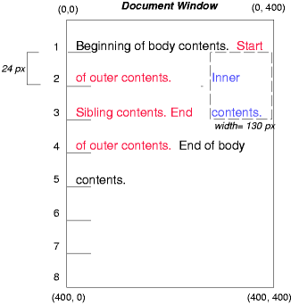
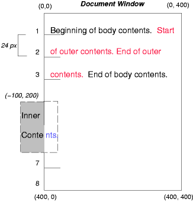

为了说明正常流，相对定位，浮动和绝对定位的区别，我们基于下面的HTML提供了一组例子：

	<!DOCTYPE HTML PUBLIC "-//W3C//DTD HTML 4.01//EN">
	<HTML>
	  <HEAD>
	    <TITLE>Comparison of positioning schemes</TITLE>
	  </HEAD>
	  <BODY>
	    
Beginning of body contents.
	       Start of outer contents.
	       Inner contents.
	      End of outer contents.
	      End of body contents.
	    

	  </BODY>
	</HTML>

这个文档中，我们假定下面的规则：

	body { display: block; font-size:12px; line-height: 200%; 
	       width: 400px; height: 400px }
	p    { display: block }
	span { display: inline }

outer和inner元素生成的盒子的最终位置在每个例子里是不同的。在每个插图中，插图左边的数字标明了双倍空间（为了准确标识）行的正常流的位置。

>译注：这里的双倍空间行是由上面的line-height：200%产生的。

>注意：本节的图是用作说明的并且不能缩放。它们用于指出CSS2.1中不同的定位方案之间的不同，而不是作为所给例子的参考渲染结果。

### 9.8.1 正常流
考虑下面关于outer和inner的声明，它们不会改变盒子的正常流：

	#outer { color: red }
	#inner { color: blue }

p元素包含所有行内内容：匿名的行内文本和两个span元素。因此，所有的内容将在一个行内格式化上下文，在一个由p元素创建的包含盒中进行布局，像下面这样：

### 9.8.2 相对定位

看相对定位的结果，我们指定：

	#outer { position: relative; top: -12px; color: red }
	#inner { position: relative; top: 12px; color: blue }

outer向上移动了12px，inner保持在原有位置，因为inner的top是12px。

注意outer后面的内容不受outer的相对定位的影响。

注意如果outer的偏移量是“-24px”，outer的文本和body的文本将重叠。

### 9.8.3 浮动盒

现在考虑通过下面的规则，浮动inner元素的文本到右边的效果：

	#outer { color: red }
	#inner { float: right; width: 130px; color: blue }

文本正常的流动在inner盒的顶部，inner盒被拉出流并且浮动到右margin（它的“width”属性被明确的定义）。浮动元素左边的line boxes被缩短，文档中剩下的文本排布到它们里面。

为了展示“clear”属性的效果，我们给例子添加一个兄弟元素：

	<!DOCTYPE HTML PUBLIC "-//W3C//DTD HTML 4.01//EN">
	<HTML>
	  <HEAD>
	    <TITLE>Comparison of positioning schemes II</TITLE>
	  </HEAD>
	  <BODY>
	    
Beginning of body contents.
	       Start of outer contents.
	       Inner contents.
	       Sibling contents.
	      End of outer contents.
	      End of body contents.
	    

	  </BODY>
	</HTML>

应用下面的规则：

	#inner { float: right; width: 130px; color: blue }
	#sibling { color: red }

这个规则导致inner盒浮动到右边并且文档中剩下的文本排布到空出的空间中：

但是，如果兄弟元素的“clear”属性被设置成“right”（就是，生成的兄弟盒不接受它右边的浮动盒的一个位置），兄弟内容开始流动到浮动元素的下面：

	#inner { float: right; width: 130px; color: blue }
	#sibling { clear: right; color: red }

### 9.8.4 绝对定位

最后，我们考虑绝对定位的效果。考虑下面对outer盒inner的CSS声明：

	#outer { 
	    position: absolute; 
	    top: 200px; left: 200px; 
	    width: 200px; 
	    color: red;
	}
	#inner { color: blue }

这些导致了outer盒的顶部被定位到与它的包含块相关的地方。这个包含块通过最近的已定位的祖先节点建立（或者，如果不存在，在我们的例子中，将使用初始化的包含块）。outer盒的上边在包含块下方“200px”处而左边距离包含块左边“200px”。outer的子节点相对它们的父节点正常流动。

下面的例子展示了一个相对定位盒中的绝对定位盒。尽管父亲outer节点没有确切的偏移，设置它的“position”属性为“relative”是为了让它的盒子可以作为定位的子孙节点的包含盒服务。因为outer盒子是一个被分割成多行的行内盒，所以第一个行内盒的顶部盒左边缘（在下面的图例中用细虚线描绘出来的那个地方）作为“top”和“left”的偏移的参考位置。

	#outer { 
	  position: relative; 
	  color: red 
	}
	#inner { 
	  position: absolute; 
	  top: 200px; left: -100px; 
	  height: 130px; width: 130px; 
	  color: blue;
	}

结果如下：

如果outer不是相对定位：

	#outer { color: red }
	#inner {
	  position: absolute; 
	  top: 200px; left: -100px; 
	  height: 130px; width: 130px; 
	  color: blue;
	}

inner的包含块变成默认包含块（在我们的例子中）。下面的图例展示了这种情况下inner盒子将被放置在什么地方。

