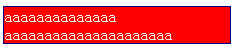

当使用'width', 'margin-left', 'margin-right', 'left', 'right'这些属性布局时，他们的使用值通过盒类型以及相互的关系获取。原则上，使用值和计算值相等，auto被替换成一些合适的值，百分比根据包含块计算，但是也有例外。

### 10.3.1 行内非替换元素

width属性不适用。对'margin-left'或'margin-right'指定'auto'的效果是计算值为'0'。

### 10.3.2 行内替换元素

1. 对'margin-left'或'margin-right'指定'auto'的效果是计算值为'0'。
2. width为'auto'：
	- 该元素有固有宽度：width为固有宽度。
	- 没有固有宽度，但有固有高度和固有比例：根据height与比例计算width。

### 10.3.3 正常流中的块级非替换元素

使用值必须符合下面约束：

margin-left + border-left-width + padding-left + width + padding-right + border-right-width + margin-right = 包含块的宽度

注意：margin padding 的默认值是0，border默认值和元素相关。

1. 如果所有值都不为auto：
	- 所有值之和大于包含块的宽度：对于ltr，margin-right为0；反之亦然。
	-  所有值之和小于包含块的宽度：对于ltr，margin-right占满剩下部分，反之亦然。 
2. 如果只有一个值指定为'auto'，它的计算值从等式中得出。
3. 如果'width'设置为'auto'，则其它的'auto'值成为'0'，'width'从等式的剩余部分得到。
4. 如果'margin-left'和'margin-right'为'auto'：
	- 所有值之和小于包含块宽度：两个值相等，元素居中。
	- 所有值之和大于包含块宽度：两个值都为0。

### 10.3.4 正常流中的块级替换元素

width的使用值由10.3.2中行内替换元素的规则决定。 margin规则由10.3.3中非替换块级元素的规则决定。

### 10.3.5 浮动非替换元素

shrink-to-fit 的计算公式：min(max(preferred minimum width, available width), preferred width)

CSS2.1 并未给出 preferred minimum width、available width 和 preferred width 确切算法，通常，将内容中非明确的换行外的其他部分强制不换行来计算 preferred width；反之，尝试将内容尽可能的换行，以得到 preferred minimum width；available width 即该元素的包含块的宽度减去 'margin-left'，'border-left-width'，'padding-left'，'padding-right'，'border-right-width'，'margin-right' 的值以及任何存在的纵向滚动条的宽度。

1. margin-left或margin-right为auto，使用值为0。
2. width计算值为auto，其使用值是shrink-to-fit值（简单理解为适应子元素的宽度）。

举个栗子：黑色边框可以看做是浮动div的宽度

	

	    

			aaaaaaaaaaaaaa
		

	    

	

当内容太长时发生换行。

	

	    

			aaaaaaaaaaaaaa aaaaaaaaaaaaaaaaaaaaa
		

	    

	

### 10.3.6 浮动替换元素 

1. margin-left或margin-right为auto，使用值为0。
2. width的使用值由行内替换元素的规则决定。

### 10.3.7 绝对定位非替换元素

确定这些元素计算值的约束为：

 'left' + 'margin-left' + 'border-left-width' + 'padding-left' + 'width' + 'padding-right' + 'border-right-width' + 'margin-right' + 'right' = 包含块的宽度

这一约束的实现通过如下顺序的一系列替换而达到：

1. 如果'left'设置为'auto'而'direction'为'ltr'，替换'auto'为：包含块左边到假定它的'position'属性设置为'static'，而生成元素的第一个框的那个假想框的左边距边的距离。（但是为了不去实际计算那个框，用户端可以自由地猜想它可能在的位置。）如果假想框在包含块的左边，该值为负数。
1. 如果'right'设置为'auto'而'direction'为'rtl'，替换'auto'为：包含块右边到上述提到的那个假想框的右边距边的距离。如果假想框在包含块边的左边，该值为正数。
1. 如果'width'为'auto'，将剩余'left'或'right'的'auto'替换为'0'。
1. 如果'left'，'right'或'width'还是'auto'，将所有'margin-left'或'margin-right'的'auto'替换为'0'。
1. 如果在这一步'margin-left'和'margin-right'还是'auto'，基于额外的约束即两个边距必须相同，解出等式。
1. 如果在这一步只有一个'auto'存在，根据等式解出那个值。
1. 如果在这一步各值间过度约束，要么忽略'left'的值（如果'direction'为'rtl'），要么忽略'right'的值（如果'direction'为'ltr'），然后解出那个值。

### 10.3.8 绝对定位替换元素

这一情况和前一情形类似，但是元素有一个内在宽度。替换的顺序是：

1. 如果'width'为'auto'，替换为元素的内在宽度。
1. 如果'left'设置为'auto'而'direction'为'ltr'，替换'auto'为：包含块左边到假定它的'position'属性设置为'static'，而生成元素的第一个框的那个假想框的左边距边的距离。（但是为了不去实际计算那个框，用户端可以自由地猜想它可能在的位置。）如果假想框在包含块的左边，该值为负数。
1. 如果'right'设置为'auto'而'direction'为'rtl'，替换'auto'为：包含块右边到上述提到的那个假想框的右边距边的距离。如果假想框在包含块边的左边，该值为正数。
1. 如果'left'或'right'是'auto'，将所有'margin-left'或'margin-right'的'auto'替换为'0'。
1. 如果在这一步'margin-left'和'margin-right'还是'auto'，基于额外的约束即两个边距必须相同，解出等式。
1. 如果在这一步只有一个'auto'存在，根据等式解出那个值。
1. 如果在这一步各值间过度约束，要么忽略'left'的值（如果'direction'为'rtl'），要么忽略'right'的值（如果'direction'为'ltr'），然后解出那个值。

### 10.3.9 正常流中'Inline-block'非替换元素

如果width是auto，使用值是shrink-to-fit值。计算值为auto的margin-left和margin-right，值为0。

### 10.3.10 正常流中'Inline-block'替换元素

和行内替换元素相同。